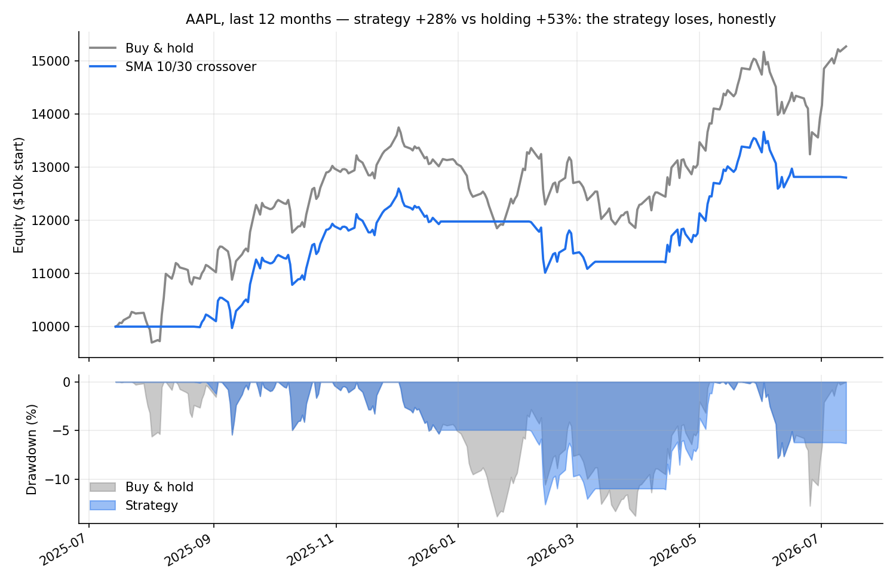

# Honest Algorithmic Trading Framework (Alpaca, Paper)

A plug-in backtesting and paper-trading framework built to answer one
question rigorously: **does a strategy actually work, or does its backtest
just say so?**

Most trading bot repos promise profits. This one ships two well-known
strategies, shows they lose, and explains exactly why. The product is the
validation machinery — plug in your own strategy and get an honest verdict
before it costs real money.

Runs entirely on Alpaca paper trading. Educational project — not financial
advice, and nothing here constitutes a profitable strategy.

## Architecture

    strategies/
      base.py           Strategy + IntradayStrategy contracts
      sma_crossover.py  daily SMA crossover plug-in
      orb.py            opening range breakout plug-in (intraday)
    engine/
      backtest.py       daily engine: multi-symbol/multi-period grid,
                        slippage, split-adjusted data, risk management
      intraday.py       intraday engine: minute bars, per-day execution,
                        level-based fills, forced flat-by-close
      risk.py           RiskConfig: stop-loss, position sizing,
                        max-drawdown kill switch
    run_backtest.py     front door: daily strategies
    run_intraday.py     front door: intraday strategies
    run_bot.py          live paper-trading runner (SMA crossover)
    test_connection.py  verify API access

Writing a new strategy = one class implementing generate_signals(df)
(daily) or plan_day(opening_bars) (intraday). The engines handle fills,
slippage, benchmarks, risk, and reporting.

## What honest backtesting required

Every item below changed results materially when added:

- **No lookahead bias** — signals shift one bar before becoming positions
  (you can't trade today on a moving average that needs today's close).
  Enforced by the framework, not left to strategy authors.
- **Split/dividend-adjusted data** — raw bars showed NVDA "losing 72%" in
  its best year ever (10:1 split read as a crash). adjustment="all".
- **Slippage modeling** — 10 bps per fill, calibrated to observed slippage
  on this repo's first live paper order ($0.34 on a $316 fill).
- **Multi-symbol, multi-period grids** — single backtests seduce. TSLA
  2024-25 shows the crossover "+74.7% vs holding"; the full 18-test grid
  shows it losing 14 of 18. Test windows must also match strategy
  timescale: a 50/200-day system tested in 1-year windows barely trades.
- **Drawdown measurement** — return alone hides what a strategy is like
  to live through.

## Findings (so you don't have to pretend otherwise)

**SMA 10/30 crossover** — 6 symbols x 3 years, 18 tests: beat buy-and-hold
4/18 (22%), average edge -12%/year. But average max drawdown 19.8% vs 24.8%
for holding — trend-following buys a smoother ride, paid for in return.

**SMA 50/200 (golden cross)** — 6 symbols x 2 four-year windows: 5/12 wins,
strongly regime-dependent (won 5/6 in 2018-22 which contained the COVID
crash; lost 6/6 in 2022-26's V-shaped recovery).

**Opening range breakout (15-min)** — 6 symbols x 60 days of 5-minute bars:
-2.1% average in two months, ~29 round trips per symbol. Near breakeven
before costs; transaction costs are the kill. Intraday trading multiplies
cost drag ~25x vs the daily system.

**Risk management** — same strategy under three regimes: an 8% stop-loss
mildly improved drawdowns with ~zero net return effect (cuts losers AND
ejects from winners that dip first). A 20% drawdown kill switch evaluated
on daily closes FAILED on a TSLA gap, locking in -59%: risk checks that
react after the damage are a receipt, not a shield.

## Setup

    pip install alpaca-py python-dotenv pandas
    cp .env.example .env    # add your Alpaca PAPER keys
    python3 test_connection.py
    python3 run_backtest.py

## Roadmap

- [ ] Port live runner (run_bot.py) into the framework
- [ ] Intraday-aware risk checks (gap risk demonstrated above)
- [ ] Ratio-based grid metrics (avg percentage-point edge distorts across
      return magnitudes)
- [ ] Walk-forward validated ML signal
- [ ] Scheduled runs + trade logging
